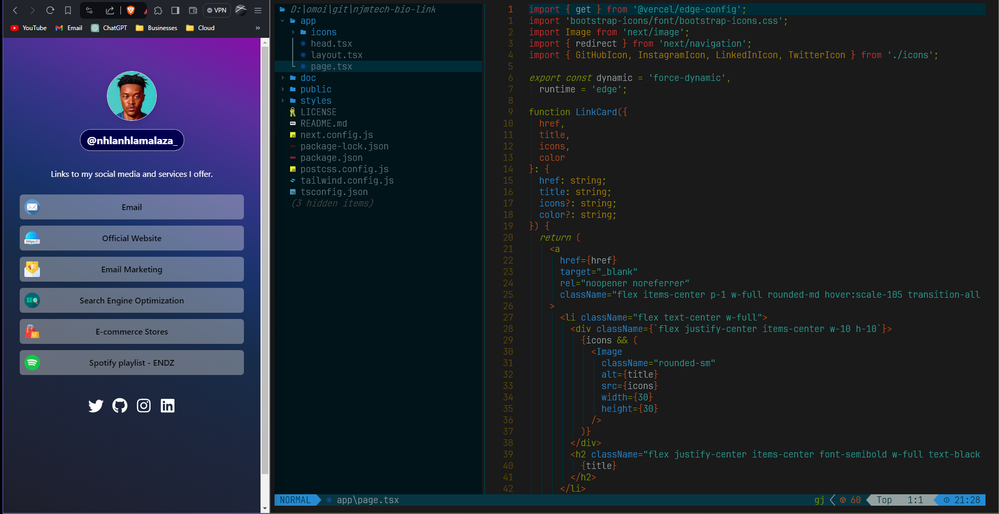

# NJMTECH bio link

[https://njmbio.vercel.app/](https://njmbio.vercel.app/)

## Tutorial

Watch how I built this website on YouTube:

[](https://www.youtube.com/watch?v=eFzNekhVhmM&t=3550s)

This is a [Next.js](https://nextjs.org/) project bootstrapped with [`create-next-app`](https://github.com/vercel/next.js/tree/canary/packages/create-next-app).

## Stack

- [Next.js](https://nextjs.org/) - A React framework with hybrid static & server rendering, and route pre-fetching, etc.
- [Tailwind](https://tailwindcss.com/) - The main feature of this CSS library is that, unlike other CSS frameworks like Bootstrap, it does not provide a series of predefined classes for elements such as buttons or tables.

```
$PROJECT_ROOT
├── app
│   ├── icons
│   │   └── index.tsx
│   ├── head.tsx
│   ├── layout.tsx
│   └── page.tsx
│
├── styles
│   └── global.css
│
└── public
    ├── icons
    │   └── seo.png
    │   └── ...
    │
    ├── favicon.ico
    │
    └── ...
```

## License

MIT License.

You can create your own homepage for free without notifying me by forking this project under the following conditions:

- Add a link to [my bio link](https://njmbio.vercel.app/)
- Do not use the 3d voxel dog

Check out [LICENSE](./LICENSE) for more detail.

---
